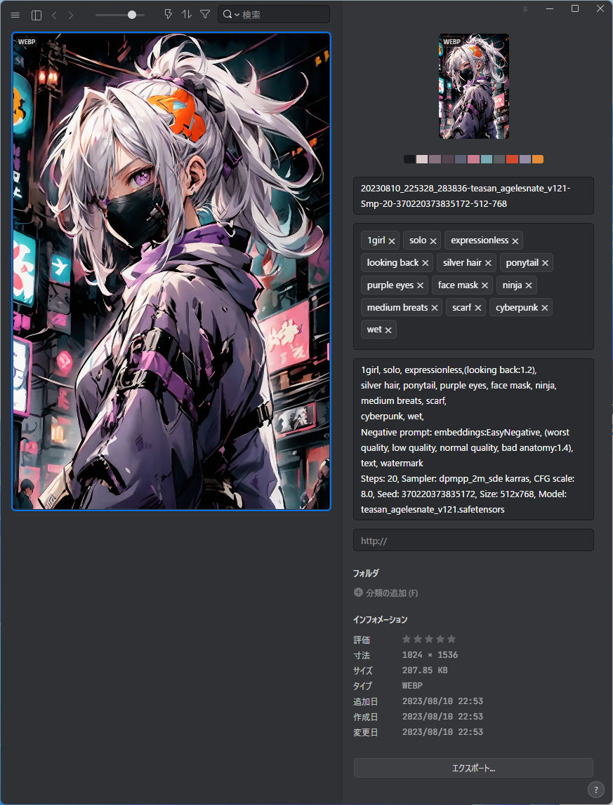

# ComfyUI-send-Eagle(slim)
[Japanese README](README.ja.md)

This is an extension node for [ComfyUI](https://github.com/comfyanonymous/ComfyUI) that allows you to send generated images in webp format to [Eagle](https://en.eagle.cool/). This extension node is a re-implementation of the Eagle linkage functions of the previous [ComfyUI-send-Eagle](https://github.com/shingo1228/ComfyUI-send-eagle) node, focusing on the functions required for this node. 
This README.md is translated by ChatGPT Plus with Code Interpreter from [Japanese README](README.ja.md).

## Features
Sends the image inputted through `image` in webp format to Eagle running locally. 
You can choose between lossy compression (quality settings) and lossless compression.
This extension node creates a subfolder in the ComfyUI output directory in the "YYYY-MM-DD" format.
The naming rule for image files is as follows, which follows the settings I use in AUTOMATIC1111's StableDiffusion webui. Currently, you cannot change this subfolder creation or filename:

./ComfyUI/output/YYYY-MM-DD/YYYYMMDD_HHMMss_SSSSSS-{`model_name`}-Smp-{`steps`}-{`seed`}-{`FinalImage_width`}-{`FinalImage_height`}.webp

In ComfyUI, when processing reaches that node, it implicitly receives objects called `prompt` and `extra_pnginfo`. The `prompt` contains workflow inter-node linkage information in json format, and `extra_pnginfo` contains detailed information (node name, list items, coordinates, size, etc.) of the nodes that make up the workflow in json format. By embedding this information in the generated image file, this feature allows you to recreate the node configuration at the time of generation by dropping the image onto ComfyUI.

In this extension node, we achieve the following functions from the information of `prompt` and `extra_pnginfo`:

- Embed `prompt` and `extra_pnginfo` in webp format exif information and recreate workflow by image drop. 

- Analyze json information of `prompt` and register the following generation information in the memo (annotation) of Eagle from `KSampler` node and `KSamplerAdvanced` node (hereinafter referred to as generation standard node):
   - "Number of generation steps", "Sampler name", "Scheduler name", "CFC scale", "Seed value"
   - Width and height of Latent from the upstream node of input:`latent` of the generation criterion node (assuming `Empty Latent Image` node).
   - "Model name" from the upstream node of input:`model` of the generation criterion node (if there is a `Load LoRA` node in between, it will be ignored and `ckpt_name` will be searched recursively).
   - "Generation prompt" and "Negative prompt" from the upstream nodes of input:`positive` and `negative` of the generation criterion node.
   - If `CLIPTextEncodeSDXL` was used and the contents of `text_g` and `text_l` were the same, the content of `text_g` will be "Generation prompt (format: text_g:{text_g} text_l:{text_l})".
   - This information is linked to the memo (annotation) of Eagle in the following format:
      {`prompt`} NegativePrompt:{`NegativePrompt`} "Steps: {`steps`}, Sampler: {`sampler_name`} {`scheduler`}, CFG scale: {`cfg`}, Seed: {`seed`}, Size: {`width`}x{`height`}, Model: {`model_name`}" 

   - Based on this information, the file name is generated with the following naming rule:
     YYYYMMDD_HHMMss_SSSSSS-{`model_name`}-Smp-{`steps`}-{`seed`}-{`FinalImage_width`}-{`FinalImage_height`}.webp 

   - The "Generation prompt" analyzed from `prompt` is split and registered as a tag in the tags of Eagle. 

## Limitations
- If there are multiple `KSampler` nodes and `KSamplerAdvanced` nodes in the workflow, the node number (official item name unknown) that is implicitly numbered will be used as the generation criterion node. This is because it is not possible to distinguish whether the purpose of the Sampler node is "for generation", "for Refiner", or "for Hires.fix". Therefore, in workflows where the "Generation prompt" and "Hires.fix prompt" are defined differently, it may not be possible to obtain the desired generation prompt.
- The nodes that have been tested are as follows among the standard nodes of ComfyUI:
   - Sampler: `KSampler`,`KSamplerAdvanced`
   - Latent Image: `Empty Latent Image`
   - CLIP: `ClIP TextEncoder(Prompt)`,`CLIPTextEncodeSDXL`

- Provisional Implementation support
   - Sampler: `KSampler With Refiner (Fooocus)`
   - Prompt: `SDXL Prompt Styler`

- Even if the workflow is composed of the above standard nodes, due to the high degree of freedom in ComfyUI configuration, there is a possibility that the expected information cannot be obtained. (In that case, it may be difficult to respond or logically impossible to respond).
- For nodes other than the above (both standard and extended), I will proceed with operation verification and support from the nodes with the desired features.

## Install
1. Navigate to the ComfyUI custom nodes directory.
2. `git clone https://github.com/shingo1228/ComfyUI-send-eagle`

## Update
1. Navigate to the cloned repo e.g. `custom_nodes/ComfyUI-send-eagle`
2. `git pull`

## Change History
- 2023/08/17 Initial release.
- 2023/08/18 Provisional Implementation support for `KSampler With Refiner (Fooocus)`,`SDXL Prompt Styler`.
- 2023/08/22 Added flag to parse `prompt` information and send to Eagle.